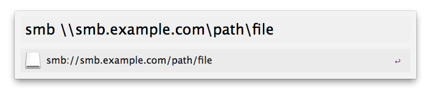

Alfred-smb
==========

This is an *Alfred* workflow.

This workflow will help you convert smb path  '\\\\...' and 'smb://...'. 

### Download

Download the latest release here [https://github.com/Witcher42/Alfred-smb/releases](https://github.com/Witcher42/Alfred-smb/releases).

### Usage

* Pass a *smb://* path, give you a *\\\\...* path.

        smb smb://smb.example.com/path/file

* Pass a *\\\\...* path, give you a *smb://* path.

        smb \\smb.example.com\path\file

### Screenshot

